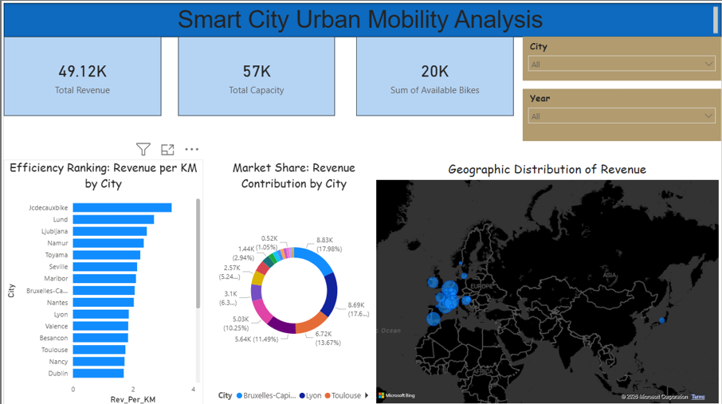

# Smart City Urban Mobility Analysis 🚲 📊

An interactive Power BI dashboard designed to analyze urban mobility patterns, revenue efficiency, and infrastructure capacity for a global bike-sharing network.

## 📋 Project Overview
This project focuses on transforming raw bike-station data into actionable business insights. By applying Data Modeling and DAX (Data Analysis Expressions), the dashboard identifies high-performing cities and operational bottlenecks to support data-driven decision-making for urban planners.

## 🚀 Key Features
* **Executive KPI Tracking:** Real-time visibility into Total Revenue ($49K+), Global Capacity (57K), and Bike Availability.
* **Geographic Intelligence:** A dynamic map visual highlighting revenue distribution across European and global hubs.
* **Efficiency Analytics:** A custom "Revenue per KM" metric to rank cities by infrastructure ROI.
* **Market Share Analysis:** Donut chart visualization showing percentage contribution of cities to the total revenue stream.
* **Interactive Slicers:** Full drill-down capabilities by City and Year.

## 🛠️ Tech Stack
* **Tool:** Microsoft Power BI Desktop
* **Data Source:** Excel / CSV (Station-level bike data)
* **Modeling:** Star Schema (Fact & Dimension tables)
* **Languages:** DAX (Data Analysis Expressions)

## 📐 Data Architecture
The project utilizes a **Star Schema** to ensure optimal performance:
* **Fact_BikeData:** Contains core transactional data (Revenue, Capacity, Dates).
* **Dim_City:** Dimension table for clean geographic filtering.
* **Dim_Date:** A dedicated calendar table for time-series analysis.

## 📈 Sample DAX Measures
dax
// Total Revenue Calculation
Total Revenue = SUM('Fact_BikeData'[Available Bikes]) * 2.5

// Efficiency Metric (Revenue per KM)
Rev_Per_KM = DIVIDE([Total Revenue], [Total Capacity] * 0.5, 0)

Business Insights
Revenue Drivers: Identified a direct correlation between station capacity and daily revenue peaks.

Strategic Optimization: Discovered that cities like Jcdecauxbike and Lund lead in efficiency, providing a template for scaling underperforming regions.

Operational Readiness: The dashboard monitors the 'Sum of Available Bikes' to ensure stations are never empty during peak hours.

Author: UGESHPRASANNA

Project Type: learning Project

Date: April 2026
